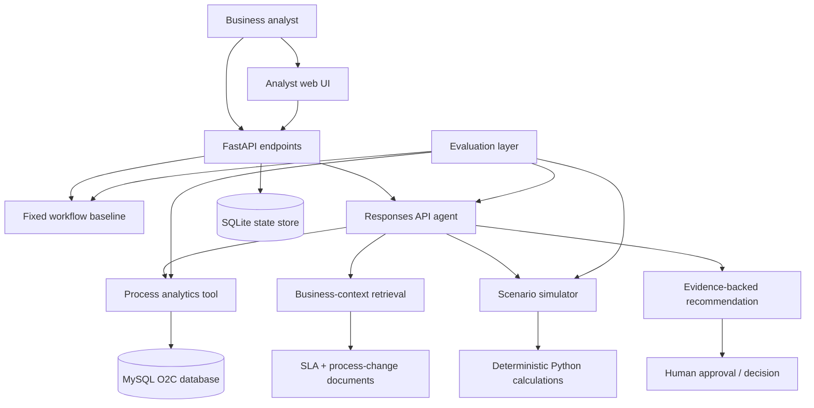
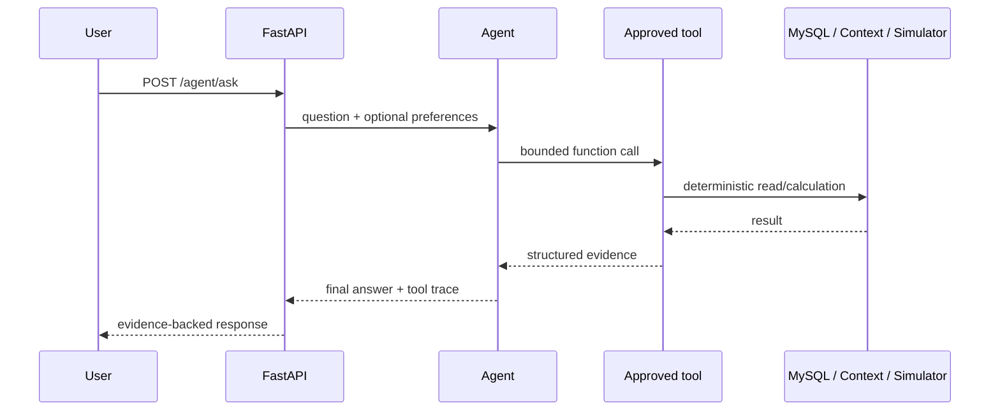
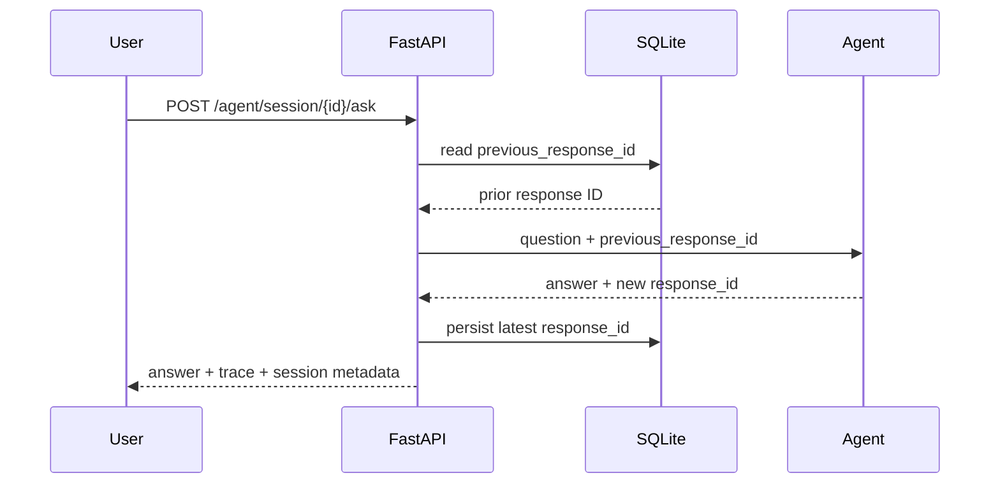
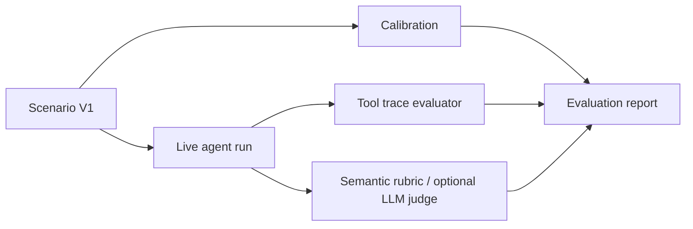

# System Architecture

## High-level architecture

## Responsibility boundaries

| Component | Responsibility | Explicitly does not do |
|---|---|---|
| Analyst UI | Collect business questions, session/profile IDs, and display answers/traces | Reimplement business logic or calculate KPIs |
| FastAPI | Request validation, routing, session/profile endpoints | Decide business conclusions |
| Responses API agent | Decide which approved tool to call next and synthesize findings | Execute arbitrary SQL, write operational records, or claim unsupported causality |
| Process analytics | Deterministic KPI queries and grouped comparisons | Free-form SQL generation |
| Business-context retrieval | Retrieve SLA, guardrail, and process-change context | Treat timing/correlation as causal proof |
| Scenario simulator | Deterministic what-if arithmetic | Estimate causal intervention effects |
| SQLite state | Session response IDs, timestamps, bounded analyst preferences | Store unrestricted raw O2C history or unrestricted memory |
| MySQL O2C DB | Synthetic transactional source and analytical views | Accept agent write actions |
| Evaluation layer | Calibration, trace checks, semantic rubric, reporting | Override deterministic KPI/tool truth with subjective scoring |

## Request flow

### Stateless question

### Stateful follow-up

## Data and control boundaries

### Deterministic zone

The following are deliberately outside model free-form reasoning:

- SQL KPI calculations;
- period-over-period arithmetic;
- grouped metric comparison;
- stage ranking returned by analytical tools;
- scenario arithmetic;
- trace-rule checks;
- semantic-score aggregation.

### Model reasoning zone

The model is used for:

- interpreting the analyst's business question;
- deciding which approved tool to call next;
- deciding whether another drill-down is needed;
- synthesizing evidence and business context;
- expressing uncertainty and assumptions;
- drafting a bounded recommendation.

### Human approval zone

The agent may analyze, simulate, and recommend, but it does not have tools to:

- change customer payment terms;
- update orders, invoices, shipments, or payments;
- send customer/supplier communications;
- approve spending;
- modify operating policy;
- implement a process change.

## Evaluation architecture

The hidden Scenario V1 ground truth is used only for evaluation design/calibration. It is not provided to the agent or semantic judge as context.

## Why a single agent

A single orchestrating agent is sufficient for the current problem because all tools participate in one bounded O2C investigation loop. Multi-agent orchestration would add coordination cost without a demonstrated business need. It remains an optional extension only if a future version introduces independently owned domains or parallel research tasks that materially benefit from separate agents.
